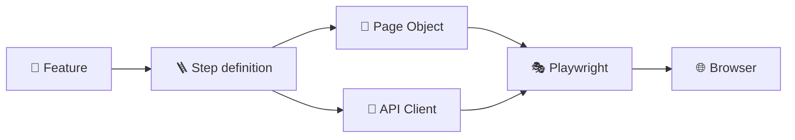

<div align="center">

# 🎭 Playwright BDD Test Project

### Readable Gherkin scenarios powered by Playwright and TypeScript


An example UI and API test automation framework combining **Playwright**, **TypeScript**, **Gherkin**, and the **Page Object Model**.

</div>

---

## ✨ Highlights

- 🥒 Business-readable `Given / When / Then` scenarios
- 🔌 UI and API tests in one BDD framework
- 📄 Page Object Model for maintainable browser interactions
- 🧩 Typed Playwright fixtures for dependency injection
- 🌐 Cross-browser execution in Chromium, Firefox, and WebKit
- 📊 Playwright and Cucumber HTML reports
- 📸 Screenshots, videos, and traces for failed tests
- 🚀 GitHub Actions workflow included
- 🏠 Self-contained local application — no external website required

## 🧱 Architecture



| Layer | Location | Responsibility |
|---|---|---|
| 🥒 Features | `tests/features` | Describe user behavior in Gherkin |
| 🪜 Steps | `tests/steps` | Connect Gherkin phrases to automation code |
| 📄 Page Objects | `tests/page-objects` | Store locators and reusable browser actions |
| 🔌 API Clients | `tests/api-clients` | Send HTTP requests and validate API responses |
| 🧩 Fixtures | `tests/fixtures` | Create and inject Page Objects |
| 🖥️ Test application | `app` | Provide local pages used by the scenarios |

> [!IMPORTANT]
> The `.features-gen` directory is generated automatically by `bddgen`. Do not edit its files manually.

## 📁 Project structure

```text
.
├── 📂 app/
│   ├── auth.html                       # Login and registration page
│   └── index.html                      # Todo page
├── 📂 scripts/
│   └── server.mjs                      # Lightweight local HTTP server
├── 📂 tests/
│   ├── 📂 api-clients/
│   │   └── users.api.ts                 # Users API requests and assertions
│   ├── 📂 features/
│   │   ├── authentication.feature      # Login and registration scenarios
│   │   ├── todo.feature                # Todo scenarios
│   │   └── users-api.feature           # Users API scenario
│   ├── 📂 fixtures/
│   │   └── test.fixture.ts             # Page Object fixtures and BDD bindings
│   ├── 📂 page-objects/
│   │   ├── auth.page.ts                # Authentication actions and locators
│   │   └── todo.page.ts                # Todo actions and locators
│   └── 📂 steps/
│       ├── auth.steps.ts               # Authentication step definitions
│       ├── todo.steps.ts                # Todo step definitions
│       └── users-api.steps.ts           # API step definitions
├── ⚙️ playwright.config.ts             # BDD, browser, reporter, and server config
├── ⚙️ tsconfig.json                     # TypeScript configuration
└── 📦 package.json                      # Dependencies and npm scripts
```

## 🚀 Quick start

### Prerequisites

- Node.js 20 or later
- npm

### 1. Install dependencies

```bash
npm install
npx playwright install
```

### 2. Run all scenarios

```bash
npm test
```

The command generates native Playwright tests from the `.feature` files and runs them in all configured browsers.

### 3. Open the report

```bash
npm run report
```

Reports are generated in:

- 🎭 Playwright: `playwright-report/index.html`
- 🥒 Cucumber: `cucumber-report/index.html`

## 🥒 Writing a Gherkin scenario

Create or edit a `.feature` file under `tests/features`:

```gherkin
Feature: User authentication

  Background:
    Given I open the authentication page

  Scenario: User logs in
    When I log in with email "user@example.com" and password "secret123"
    Then I should see the authentication message "Welcome, user@example.com"

  Scenario: User registers
    When I register with name "Anna", email "anna@example.com" and password "secret123"
    Then I should see the authentication message "Account created for Anna"
```

The feature describes **what** the user does without exposing browser implementation details.

## 🔌 API testing

The project includes a complete API testing example using Playwright's `APIRequestContext`. API scenarios use the same fixtures, Gherkin syntax, reports, tags, and test runner as the UI scenarios.

### Example endpoint

```http
GET /api/users/1
```

Example JSON response:

```json
{
  "id": 1,
  "name": "Ada Lovelace",
  "role": "admin"
}
```

### Gherkin API scenario

```gherkin
@api
Feature: Users API

  Scenario: Get an existing user
    When I request user with id 1
    Then the API response status should be 200
    And the response should contain user name "Ada Lovelace"
```

The `@api` tag allows API scenarios to be executed separately from UI scenarios.

### API step definitions

Step definitions connect the readable scenario to the API client:

```ts
When('I request user with id {int}', async ({ usersApi }, id: number) => {
  await usersApi.getUser(id);
});

Then('the API response status should be {int}', async ({ usersApi }, status: number) => {
  await usersApi.expectStatus(status);
});
```

### API client

HTTP requests and response assertions are encapsulated in `tests/api-clients/users.api.ts`:

```ts
async getUser(id: number): Promise<void> {
  this.response = await this.request.get(`/api/users/${id}`);
  this.responseBody = await this.response.json();
}
```

### Running API tests

Run only scenarios marked with `@api`:

```bash
npm run test:api
```

Run API tests with the Playwright command directly:

```bash
npm run bddgen
npx playwright test --grep @api
```

API test results are included in both Playwright and Cucumber HTML reports.

## 🪜 Creating a step definition

Every new Gherkin phrase needs a matching definition in `tests/steps`:

```ts
When(
  'I log in with email {string} and password {string}',
  async ({ authPage }, email: string, password: string) => {
    await authPage.login(email, password);
  },
);
```

Common parameter types:

| Expression | Accepts | Example |
|---|---|---|
| `{string}` | Quoted text | `"user@example.com"` |
| `{int}` | Integer | `3` |
| `{float}` | Decimal number | `19.99` |

## 📄 Creating a Page Object method

Keep locators and browser interaction inside a Page Object:

```ts
async login(email: string, password: string): Promise<void> {
  await this.page.getByLabel('Login email').fill(email);
  await this.page.getByLabel('Login password').fill(password);
  await this.page.getByRole('button', { name: 'Log in' }).click();
}
```

This keeps feature files readable and step definitions small.

## 🧭 Adding a new test flow

1. 📄 Create a class in `tests/page-objects`.
2. 🎯 Add locators and reusable interaction methods.
3. 🧩 Register the Page Object in `tests/fixtures/test.fixture.ts`.
4. 🪜 Add matching definitions in `tests/steps`.
5. 🥒 Write the scenario in `tests/features`.
6. ✅ Run `npm test`.

## 🛠️ Available commands

| Command | Description |
|---|---|
| `npm test` | Generate and run all BDD tests |
| `npm run test:api` | Run only scenarios tagged with `@api` |
| `npm run bddgen` | Generate Playwright tests from Gherkin |
| `npm run test:headed` | Run with visible browser windows |
| `npm run test:ui` | Open Playwright UI mode |
| `npm run test:debug` | Run with Playwright Inspector |
| `npm run report` | Open the Playwright HTML report |

## 🤖 Continuous integration

The included GitHub Actions workflow:

1. Installs Node.js and project dependencies.
2. Installs Playwright browsers and system dependencies.
3. Runs every BDD scenario.
4. Uploads the Playwright HTML report as an artifact.

---

<div align="center">

Built with 🎭 Playwright, 🥒 Gherkin, and 💙 TypeScript.

</div>
